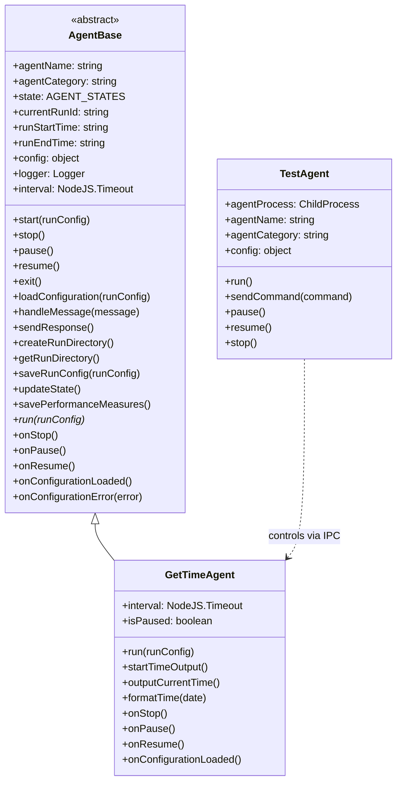
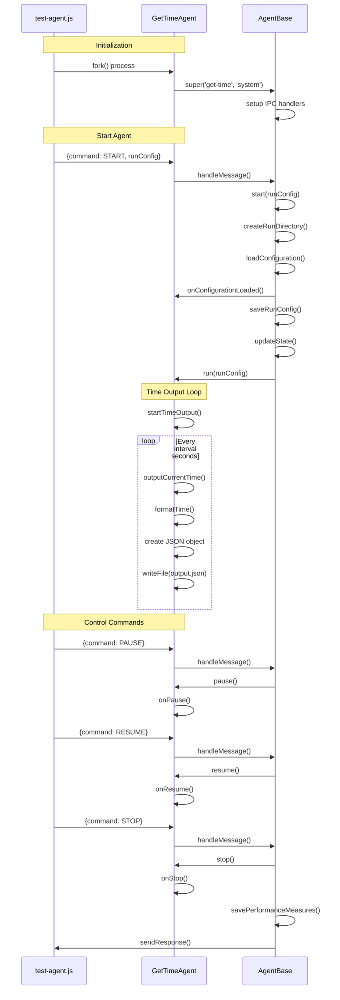
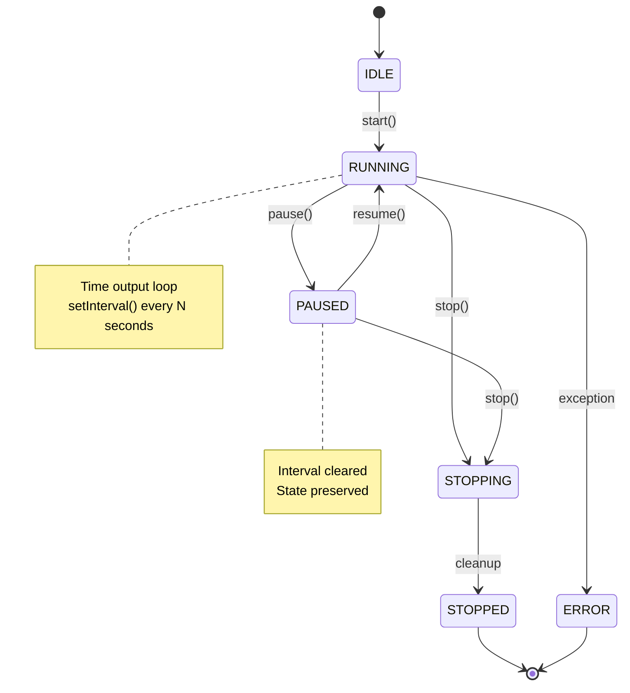
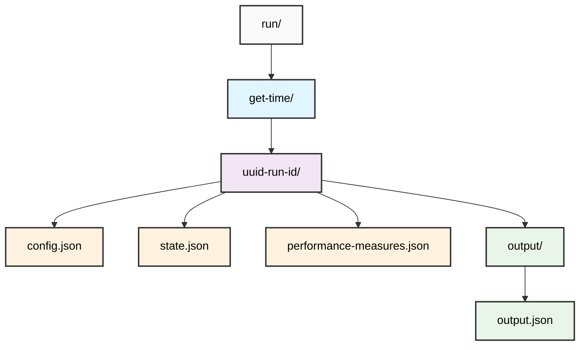
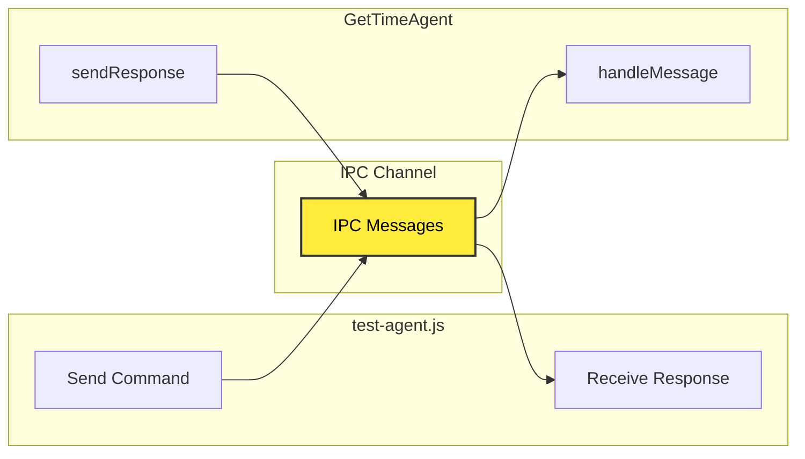
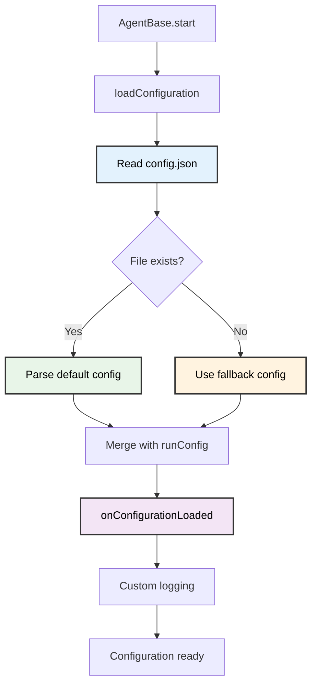
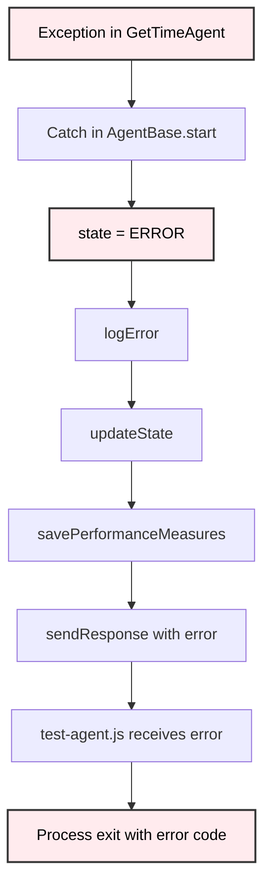
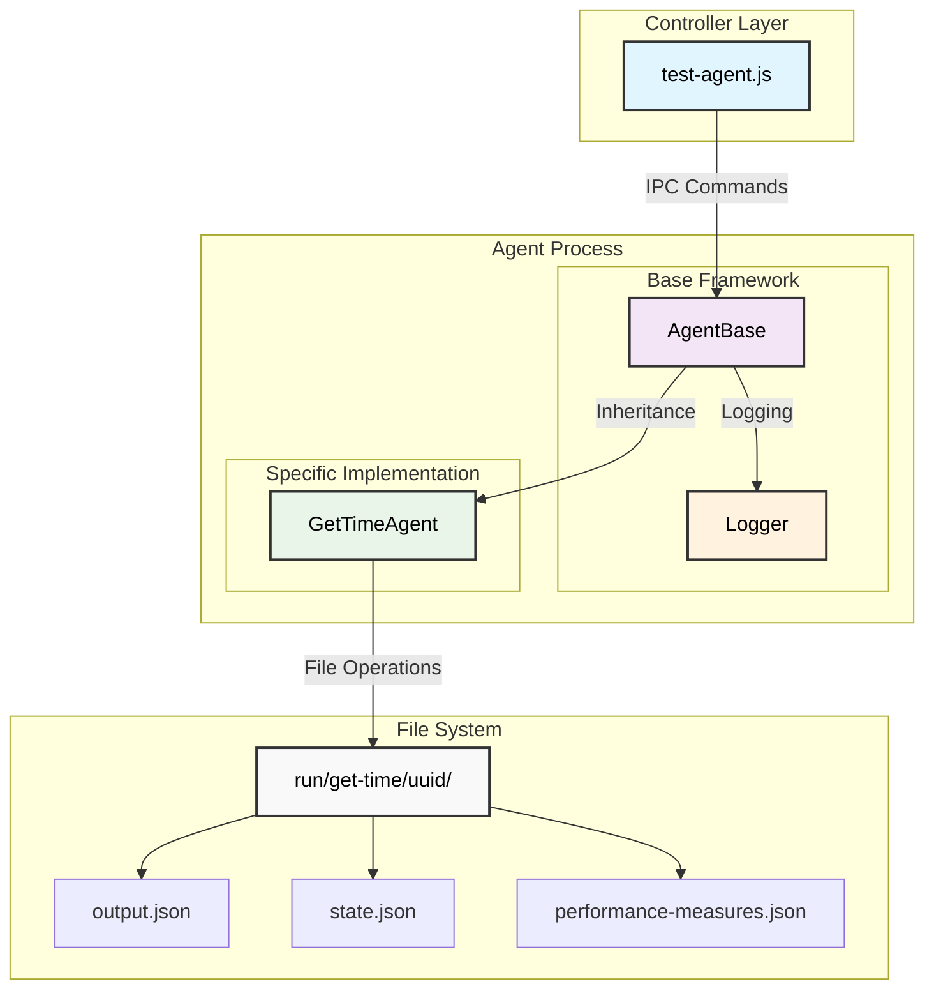

# Agent Functional Diagram

## Overview

This document describes the functional architecture and control flow between the `AgentBase` class, the `GetTimeAgent` derived class, and the `test-agent.js` controller using Mermaid diagrams.

## Class Hierarchy

## Control Flow Diagram

## State Management Diagram

## File System Structure

## IPC Communication Flow

## Configuration Loading Process

## Error Handling Flow

## Component Interaction Overview

## Key Features Summary

### AgentBase Capabilities:
- **Process Management**: IPC communication, graceful shutdown
- **Configuration Management**: Default config loading, run config merging
- **State Management**: Persistent state tracking, performance metrics
- **Logging**: Structured logging with internationalization support
- **Error Handling**: Comprehensive error handling and recovery

### GetTimeAgent Specifics:
- **Time Formatting**: Timezone-aware time formatting (HH:mm:ss)
- **JSON Output**: Structured output with timestamp and timezone
- **Interval Control**: Configurable intervals, single-run mode (interval=0)
- **Pause/Resume**: Maintains state during pause/resume cycles

### test-agent.js Controller:
- **Process Spawning**: Creates isolated agent process
- **Command Sending**: Sends IPC commands to control agent
- **Response Handling**: Processes agent responses and state changes
- **Timeout Management**: Automatic agent termination for testing

This architecture provides a robust, extensible framework for agent development with clear separation of concerns between the base framework, specific agent implementations, and test controllers.
